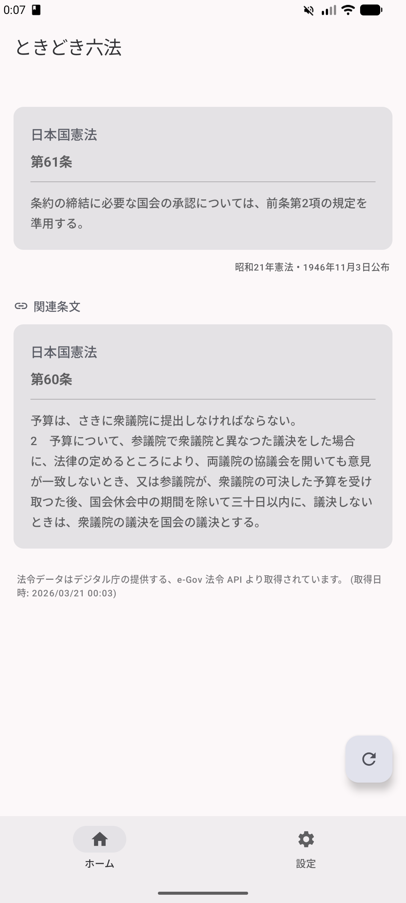
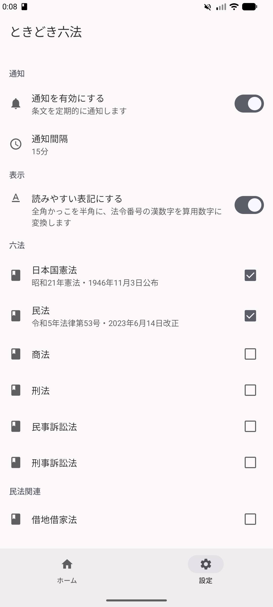
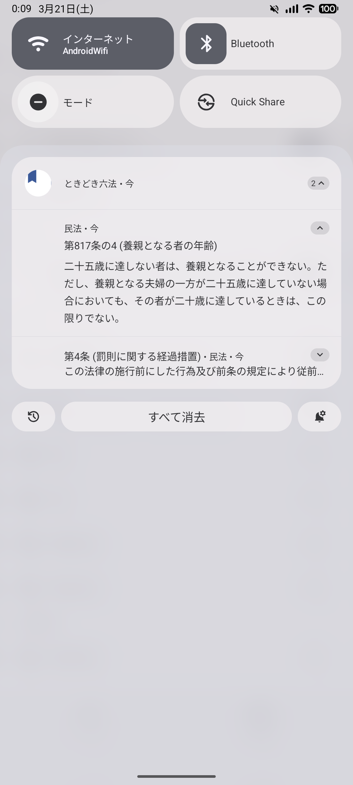

# ときどき六法

一定間隔で日本の法令の条文を通知してくれる Android アプリです。日常の中で自然と法律に触れる機会を作ります。

## スクリーンショット

<!-- markdownlint-disable MD033 MD045 -->

  
  
  

<!-- markdownlint-enable MD033 MD045 -->

## テスト版の配布

Firebase App Distribution でテスト版を配布しています。以下のリンクからテスターとして参加できます。

<https://appdistribution.firebase.dev/i/8b467d295cf1a856>

## 機能

- 設定した間隔で条文が通知される (オフラインでも動作)
- 通知タップでアプリ内に条文を表示
- 表示中の条文から参照されている関連条文も併せて表示
- 全角かっこの半角化・漢数字の算用数字変換オプション
- 法令データは [e-Gov 法令 API](https://laws.e-gov.go.jp/api/2/) からローカルに取得・キャッシュ

## 対応法令

| カテゴリ | 法令 |
| --- | --- |
| 六法 | 日本国憲法、民法、商法、刑法、民事訴訟法、刑事訴訟法 |
| 民法関連 | 借地借家法 |
| 行政法 | 内閣法、国家行政組織法、行政機関情報公開法、公文書等の管理に関する法律、行政手続法、行政代執行法、行政不服審査法、行政事件訴訟法、国家賠償法、地方自治法 |
| 商法関連 | 会社法 |
| 行政書士業務関連 | 行政書士法、戸籍法、住民基本台帳法 |
| 情報関連法 | デジタル行政推進法、個人情報保護法、番号利用法、情報公開・個人情報保護審査会設置法、電子消費者契約法、電子署名法、公的個人認証法 |

## 技術スタック

- Kotlin / Jetpack Compose / Material 3
- マルチモジュール構成 (app, core:domain, core:data, core:ui, feature:home, feature:settings)
- Hilt (DI)、Room (ローカルキャッシュ)、WorkManager (バックグラウンド通知・キャッシュ更新)、DataStore (設定)
- Ktor Client (e-Gov 法令 API)
- GitHub Actions CI / Firebase App Distribution
